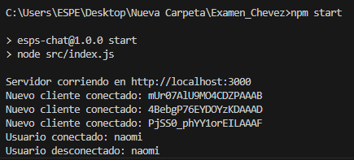
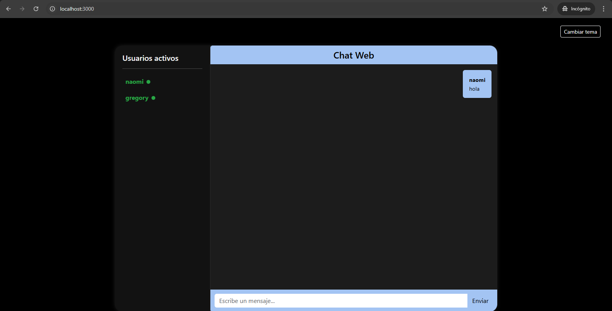
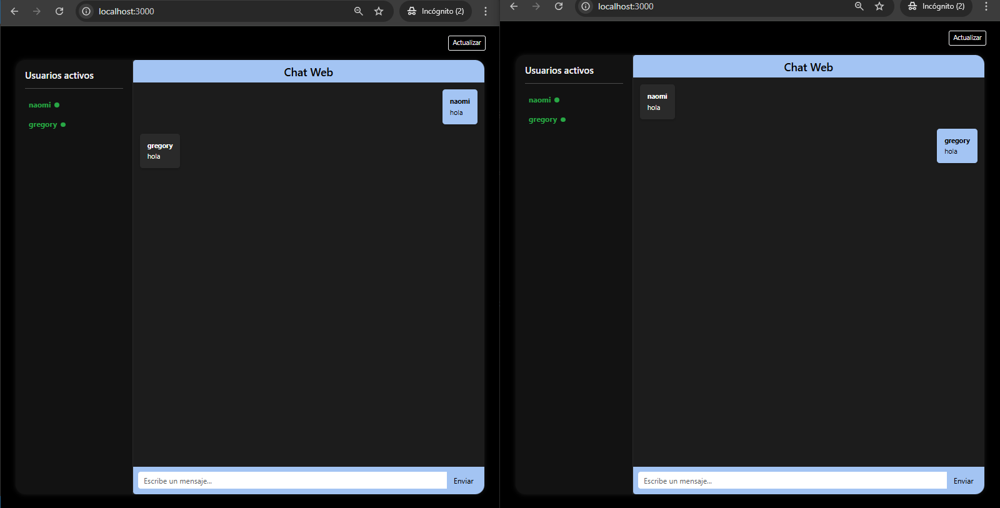

# Chat en Tiempo Real con Socket.IO

**Nombre del estudiante:** Karlos Gregory Cheevz Bazan
**Fecha de entrega:** 30 de mayo de 2025

---

## Introducción

Este proyecto consiste en el desarrollo de un chat en tiempo real utilizando Socket.IO, que permite la comunicación instantánea entre múltiples usuarios conectados.  
El uso de sockets es fundamental en aplicaciones en tiempo real como los chats, ya que permite enviar y recibir mensajes de manera bidireccional sin necesidad de recargar la página.

---

## Requisitos del Proyecto

### Funcionalidades requeridas:
- Comunicación en tiempo real entre múltiples usuarios.
- Mostrar la lista de usuarios conectados con estado activo o inactivo.
- Mejorar el diseño del chat para que sea moderno y responsivo.
- Mensajes alternados entre usuarios en un estilo similar a Telegram.

### Herramientas y tecnologías utilizadas:
- Node.js
- Express
- Socket.IO
- HTML/CSS (Bootstrap para estilos)

---

## Implementación del Proyecto

El proyecto está estructurado con un servidor Node.js que utiliza Socket.IO para manejar las conexiones y la transmisión de mensajes en tiempo real.  
En el cliente, HTML y Bootstrap se usan para la interfaz, y el código JavaScript para interactuar con el servidor vía sockets.

Las principales funcionalidades implementadas son:  
- Registro y conexión de usuarios con estado activo/inactivo.  
- Actualización dinámica de la lista de usuarios conectados.  
- Envío y recepción de mensajes que se muestran en burbujas alternadas para distinguir al emisor y receptor, con imágenes de perfil.  
- Cambio de tema claro/oscuro.  

### Código relevante:
```js (realTimeServer): 

    io.on("connection", (socket) => {
        console.log("Nuevo cliente conectado:", socket.id);

        socket.on("new-user", (username) => {
            socket.username = username;
            if (!users[username]) {
                users[username] = { connected: true, sockets: new Set() };
            }
            users[username].connected = true;
            users[username].sockets.add(socket.id);

            // Emitir lista con usuarios y estados
            io.emit("user-list", Object.entries(users).map(([user, info]) => ({
                user,
                connected: info.connected
            })));

            console.log("Usuario conectado:", username);
        });

        socket.on("message", (data) => {
            io.emit("message", {
                user: data.user,
                message: data.message,
            });
        });

        socket.on("disconnect", () => {
            const username = socket.username;
            if (username && users[username]) {
                users[username].sockets.delete(socket.id);
                if (users[username].sockets.size === 0) {
                    users[username].connected = false;
                }

                io.emit("user-list", Object.entries(users).map(([user, info]) => ({
                    user,
                    connected: info.connected
                })));

                console.log("Usuario desconectado:", username);
            }
        });
    });
};
```
### codigo relevante: 

```js (realTimeServer):

const express = require('express');
const { createServer } = require('http');
const realTimeServer = require('./realTimeServer');
const path = require('path');
const cookieParser = require('cookie-parser');

const app = express();
const httpServer = createServer(app);

// Configuraciones
app.set('port', process.env.PORT || 3000);
app.set('views', path.join(__dirname, 'views'));
// Para servir index.html en la raíz
app.get('/in', (req, res) => {
  res.sendFile(path.join(__dirname, 'views', 'index.html'));
});

// Para servir register.html
app.get('/register.html', (req, res) => {
  res.sendFile(path.join(__dirname, 'views', 'register.html'));
});
app.use(cookieParser());

// Rutas
app.use(require('./routes'));

// Public
app.use(express.static(path.join(__dirname, 'public')));

// Iniciar el servidor
httpServer.listen(app.get('port'), () => {
  console.log(`Servidor corriendo en http://localhost:${app.get('port')}`);
})

const { Server } = require("socket.io");

const realTimeServer = (server) => {
  const io = new Server(server);
  const users = {};

  io.on("connection", (socket) => {
    console.log("Nuevo cliente conectado:", socket.id);

    socket.on("new-user", (username) => {
      users[socket.id] = username;
      io.emit("user-list", Object.values(users));
    });

    socket.on("disconnect", () => {
      console.log("Cliente desconectado:", socket.id);
      delete users[socket.id];
      io.emit("user-list", Object.values(users));
    });
  });
};

module.exports = realTimeServer;

// Llamo al servidor en tiempo real
realTimeServer(httpServer);

```


### Capturas de Pantalla

Imagenes de ejecucion:
Ejecicucion del programa y como se conectan los usuarios al mismo



Registro de usarios:


Pantalla principal con el chat y usuarios activos:




Pantalla principal con el chat de usarios activos y desactivos:


### Instrucciones de Ejecución:

Clonar el repositorio:

git clone https://github.com/gregoryNa9/examen_chevez.git

Instalar dependencias:

npm install

Ejecutar el servidor:

npm start

Abrir el navegador y acceder a:

http://localhost:3000


### Conclusiones:

Este proyecto, desarrollado como parte de un examen práctico, me permitió aplicar los conocimientos adquiridos sobre comunicación en tiempo real mediante el uso de Socket.IO. A lo largo del proceso, comprendí en profundidad el ciclo de vida de un socket y la importancia de gestionar adecuadamente el estado de múltiples usuarios conectados.

Entre las principales dificultades encontradas se destacan:

La sincronización precisa del estado de los usuarios al momento de desconectarse.

La visualización dinámica, organizada y clara de los mensajes dentro de la interfaz del chat.

Estas problemáticas fueron abordadas mediante estructuras de datos adecuadas para distinguir usuarios activos e inactivos, así como mediante la emisión de eventos personalizados que garantizan una actualización en tiempo real del estado general del sistema.


### Referencias:
Socket.IO – Official Documentation: 
https://socket.io/docs/v4/

Bootstrap 5 – Official Documentation: 
https://getbootstrap.com/

